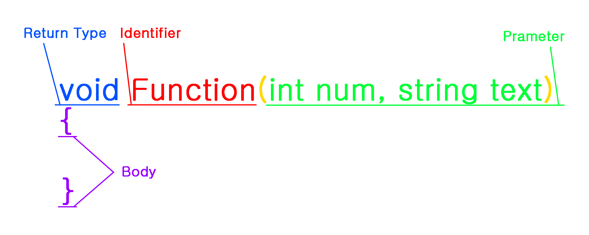

경기게임마이스터고  <br>
학생을 위한 <br>
C# 프로그래밍 입문
=================

---

# 목차

<details>
<summary><a href="#개요"> 1장. 개요 </a></summary>
<br>

- [(C#) 프로그래밍을 익혀야 하는 이유](#프로그래밍을-익혀야-하는-이유)
- [어떻게 공부하면 좋겠습니까?](#어떻게-공부하면-좋겠습니까)
- [컴파일링 테스트](#컴파일링-테스트)

</details>


<details>
<summary><a href="#기초-문법"> 2장. 기초 문법 </a></summary>
<br>

- [주석 ](#주석)
- [리터럴 값 ](#리터럴-값)
- [자료형 ](#자료형)
- [변수와 상수 ](#변수와-상수)
- [연산자 ](#연산자)
- [배열 ](#배열)
- [조건문 ](#조건문)
- [반복문 ](#반복문)
- [함수 ](#함수)

</details>

<details>
<summary><a href="#응용-문법"> 3장. 응용 문법 </a></summary>
<br>

- [다차원 배열 ](#다차원-배열)
- [재귀 함수 ](#재귀-함수)

</details>


---

# 개요
> 본 항목에서는 책에 대한 설명과 독자를 위한 정보를 제공합니다.

C#을 공부하려하는 경기게임마이스터고 학생들을 위한 교재이며, C# 프로젝트를 원활히 진행할 수 있도록 합니다.

Visual Studio Community 혹은 컴파일러를 사용 가능하다는 전제 하에 진행합니다.

위의 방법이 불가능 하다면 아래의 온라인 컴파일러 사이트를 이용하시길 바랍니다.

<details>
<summary><i><strong>온라인 컴파일러</strong></i></summary>
<br>

- [Programiz(Light, Dark)](https://www.programiz.com/csharp-programming/online-compiler/)
- [Rextester(Light, Dark)](https://rextester.com/)
- [Dotnetfiddle(Light)](https://dotnetfiddle.net/)
- [OnlineGdb(Light, Dark)](https://www.onlinegdb.com/online_csharp_compiler)

</details>

+ # 프로그래밍을 익혀야 하는 이유
    > 프로그래밍을 왜 해야하는가?

    경기게임마이스터고는 게임개발자를 양성하는 마이스터고이며, 여러분은 개발자를 목표로 공부합니다.

    아트나 기획을 한다 하여도 기초 문법에 해당하는 코드는 작성할 수 있어야 합니다.

+ # 어떻게 공부하면 좋겠습니까
    > 어떻게 공부하면 좋은가?

     &nbsp;  &nbsp;  

    장마다 난이도를 나누어 두었습니다. 자신에 맞는 공부를 하고 싶다면 아래의 방식을 추천합니다.

    프로그래밍 언어를 처음 접하는 분이라면 일단, 을 보는 것을 추천합니다.

    프로그래밍 언어를 어느정도 공부하여 기초 문법을 쉽게 이해할 수 있다면 을 가볍게 둘러보시고 을 읽은 뒤, 을 보시면 됩니다.

    마지막으로 C#을 경험한 적이 있으며 되새기는 것이 목적이라면 처음부터 하나씩 짚어보며 완독 해 보시길 바랍니다.

+ # 컴파일링 테스트
    > Hello World!를 출력합시다.

    코드가 원활히 컴파일링 되는지 확인을 합시다.

    아래의 코드를 복사하여 실행시켰을 때, 콘솔 출력으로 'Hello World!' 가 출력된다면 성공입니다.

    ```cs
    using System;

    class HelloWorld
    {
        public static void Main(string[] args)
        {
            Console.Write("Hello World!");
        }
    }
    ```

    테스트에 성공했다면 다음 장으로 넘어갑시다.

---

# 기초 문법
> 프로그램을 구성하는 기초 문법에 대해 다룹니다.

+ # 주석
    > 프로그램 속 메모장. 주석 처리

    코드 내에서 주석을 작성하는 방법을 설명하겠습니다.

    코드는 앞서 1장에서 사용한 'Hello World! 출력 코드' 를 예로서 사용합니다.

    ```cs
    using System; // System 네임스페이스 참조

    class HelloWorld
    {
        public static void Main(string[] args)
        {
            Console.Write("Hello World!"); // Hello World! 출력
        }
    }
    ```

    <details>
        <summary>출력 결과</summary>

        Hello World!
    </details>

    위 코드에서 확인할 수 있듯이 '//' 는 한 줄 주석입니다. '//' 이후, 한 줄 동안은 문장이 주석 처리됩니다.

    '/\* ~ \*/' 은 '/\*' 과 '\*/' 사이를 모두 주석 처리합니다.

    이러한 주석은 협업을 할 때, 다른 이용자에게 코드에 대한 설명을 하기 위해 사용되거나 혹은 메모를 위해 사용될 수 있습니다.

+ # 리터럴 값
    > 코딩에 사용하게 될 데이터

    리터럴 값(Literal Value)은 여러분의 컴퓨터에 미리 정의되어 있는 데이터 입니다.

    앞으로 이 리터럴 값을 이용하여 프로그램을 구성할 것입니다.

    정수형 리터럴(integer), 실수형 리터럴(floating point), 부울형 리터럴(boolean), 문자형 리터럴(character), 문자열 리터럴(string) 로 나뉘며 이에 해당하는 데이터는 타입에 대한 설명에서 다룹니다.

+ # 자료형
    > 컴퓨터가 데이터를 나누는 기준

    자료형은 컴퓨터에 저장되는 데이터의 기준입니다.

    - 정수형   
        ```cs
        byte   
        short   
        int   
        long   
        ```
        정수형은 `-1`, `0`, `1`등의 정수 형식입니다.

    - 실수형
        ```cs
        float
        double
        decimal
        ```
        실수형은 `3.14`, `1.41`등의 실수 형식입니다.   
        float은 'f', double은 'd', decimal은 'm'을 숫자 뒤에 붙여 형식을 지정합니다. (기본값은 double입니다)

    - 부울형
        ```cs
        bool
        ```
        부울형은 `true`, `false`의 값을 가지는 형식입니다.

    - 문자형
        ```cs
        char
        ```
        문자형은 `'(문자)'` 형식으로 사용하는 형식입니다. 모든 유니코드를 사용할 수 있습니다.

    - 문자열
        ```cs
        string
        ```   
        문자열은 `"(문자열)"` 형식으로 사용하는 형식입니다. 문자형과 달리 ""안에 넣을 수 있는 글자 수 제한이 없습니다.

+ # 변수와 상수
    > 데이터의 저장, 사용

    + ## 변수

        변수란 데이터를 저장하는 공간을 의미합니다.

        변수에는 데이터를 담고 꺼내어 사용할 수 있습니다.

    + ## 변수의 선언

        (자료형) 변수명; 형식으로 작성되며, 자료형은 선언 이후 변경할 수 없습니다.

        ```cs
        int number; // 정수형 number 라는 이름의 변수를 선언.
        ```

        이는 정수형(int) 으로 number 라는 이름의 변수를 사용하겠다고 선언한 것입니다.

    + ## 변수의 초기화

        ```cs
        number = 10; // 정수형 number 변수에 (정수형 리터럴 값) 10을 저장.
        int num = 'a'; // 정수형 num 변수에 (문자형 리터럴 값) a를 저장. (자료형이 다른 값을 저장하려 하여 오류가 발생합니다.)
        int copy = number; // 정수형 copy 변수에 정수형 number 변수를 저장. (copy 에 10이 저장됩니다.)
        ```

        정수형 number 변수에 정수형 리터럴 값인 10을 저장한 것입니다.

        만약, num 처럼 자료형에 다른 값을 저장하려 할 경우 문제가 발생하게 되니, 변수에는 선언한 자료형에 맞는 값만을 저장할 수 있습니다.

        변수에 변수값을 저장하는 것도 가능합니다.

    + ## 상수

        상수는 저장하는 값이 변하지 않는 변수를 의미합니다.

    + ## 상수의 선언과 초기화

        const (자료형) 변수명 = (값); 형식으로 작성되며, 선언과 동시에 리터럴 값을 저장해야 합니다.

        상수는 최초 저장 이후 값을 저장할 수 없게 되며, 값을 꺼내는 것만 가능합니다.

        ```cs
        const float pi = 3.14f; // 실수형 pi 상수에 (실수형 리터럴 값) 3.14를 저장.
        ```

        실수형 pi 상수에 실수형 리터럴 값인 3.14를 저장한 것입니다.

        ```cs
        const float pi1 = pi; // 실수형 pi1 상수에 pi 상수 저장을 시도. (상수에는 리터럴 값만 저장되기 때문에 오류가 발생합니다.)
        pi = 3.1415f; // pi 상수에 저장을 시도. (상수는 값을 변경할 수 없어 오류가 발생합니다.)
        ```

        변수를 저장하려 하거나 상수에 저장을 하려 할 경우, 오류가 발생합니다.

        변수와 상수가 제대로 동작하는지 직접 출력하여 확인합시다.

        ```cs
        using System;

        class Variable
        {
            public static void Main(string[] args)
            {
                const bool boolean = true; // 상수 boolean 선언 및 true 저장.
                int number = 10; // 변수 number 선언 및 10 저장.

                Console.WriteLine(boolean); // boolean에 저장된 true 출력.
                Console.WriteLine(number); // number에 저장된 10 출력.

                number = 20; // number에 20 저장.

                Console.WriteLine(number); // number에 저장된 20 출력.

                int copy = number; // 변수 copy 선언 및 number(20) 저장.

                Console.WriteLine(copy); // copy에 저장된 20 출력.
            }
        }

        ```

        <details>
            <summary>출력 결과</summary>

            True
            10
            20
            20
        </details>


+ # 연산자
    > 코딩의 기초. 연산

    연산이란 특정한 값을 다른 값으로 변환하는 일을 말합니다.

    이러한 연산을 연산자가 담당합니다.

    이 챕터에서는 연산자의 종류를 열거하며, 이후에 직접 사용하며 익히도록 할 것입니다.

    + ## 연산자의 분류
        + ### 피연산자의 수
            - 단항 연산자
            - 이항 연산자
            - 삼항 연산자


        연산자는 크게 '피연산자의 수'와 '기능'으로 분류할 수 있습니다만, '기능'으로 분류하는 것엔 여러 기준이 존재하여 어느 것이 옳다 할 수 없기 때문에 이를 제외하였습니다.

        위의 연산자의 분류. 단항 연산자, 이항 연산자, 삼항 연산자. <br>
        이들은 피연산자의 수 즉, 항의 수에 따라 나뉜 것입니다. <br>
        항의 수가 한 개인 연산자를 단(單)항 연산자,
        두 개인 것을 이항 연산자, 세 개인 것을 삼항 연산자라 이릅니다.

    + ## 연산자의 우선순위

        연산자의 우선순위란 연산자의 연산이 진행되는 순서를 말합니다. 상황에 맞게 의도에 맞는 연산을 하기 위해선 우선순위를 숙지하는 것이 필요합니다.

        [ (3 + 5) * 2 = 16 ] &nbsp;
        [ 3 + (5 * 2) = 13 ] <br>
        덧셈 우선연산&nbsp;&nbsp;&nbsp;&nbsp;&nbsp;&nbsp;&nbsp;&nbsp;
        곱셈 우선연산

        이처럼 연산을 연속적으로 할 경우, 연산순서에 따라 연산결과는 크게 달라지므로 올바른 결과로 유도하기 위해 연산자의 우선순위를 고려할 필요가 있습니다.

    + ## 연산자의 결합방향

        연산자의 결합방향은 우선순위가 동일한 연산자 간의 연산 방향을 나타냅니다. 이런 모습은 수학에서도 찾을 수 있으므로 예를 들어 설명하겠습니다.

        결합방향의 종류에는 좌에서 우(  ) 와 우에서 좌 (  ) 가 있습니다.

        [ 4 * 5 / 2 ] &nbsp;&nbsp;&nbsp;&nbsp; 
        [ f( g( x ) ) ] <br>
        &nbsp;&nbsp;&nbsp;&nbsp;&nbsp;
        
        &nbsp;&nbsp;&nbsp;&nbsp;&nbsp;&nbsp;&nbsp;
        &nbsp;&nbsp;&nbsp;&nbsp;&nbsp;&nbsp;&nbsp;
        

         의 예는 초등생 이상의 수학을 알고 있다면 연산 순서를 이해할 것입니다. * 와 / 는 이항 연산자이며 우선순위가 동일하고 결합방향이  입니다.

         의 예는 함수의 성질을 알고 있다면 이해할 것입니다. 먼저 g( x ) 의 연산이 이루어지고 그 결과값이 f() 의 입력값으로서 연산되는 순서로, f() 와 g() 는 단항 연산자이며 우선순위가 동일하고 결합방향이  입니다.

    + ## 연산자의 종류

        |우선순위|연산자|설명|분류|결합방향|
        |-|-|-|-|-|
        |1|[]|인덱서|이항연산자||
        ||.|멤버 연산자|기타||
        |2|++|후위 증가|단항연산자||
        ||--|후위 감소|단항연산자||
        |3|!|논리 부정 연산자|단항연산자||
        ||~|NOT 연산자|단항연산자||
        ||+|양의 부호|단항연산자||
        ||-|음의 부호|단항연산자||
        ||sizeof|메모리 크기|기타||
        ||new|메모리 할당|기타||
        ||()|캐스트 연산자|기타||
        ||++|전위 증가|단항연산자||
        ||--|전위 감소|단항연산자||
        |4|*|곱셈 연산자|이항연산자||
        ||/|나눗셈 연산자|이항연산자||
        ||%|나머지 연산자|이항연산자||
        |5|+|덧셈 연산자|이항연산자||
        ||-|뺄셈 연산자|이항연산자||
        |6|<<|좌측 시프트 연산자|이항연산자||
        ||>>|우측 시프트 연산자|이항연산자||
        |7|>|관계 연산자(좌측이 큼)|이항연산자||
        ||>=|관계 연산자(좌측이 크거나 같음)|이항연산자||
        ||<|관계 연산자(좌측이 작음)|이항연산자||
        ||<=|관계 연산자(좌측이 작거나 같음)|이항연산자||
        |8|==|관계 연산자(같음)|이항연산자||
        ||!=|관계 연산자(다름)|이항연산자||
        |9|&|AND 연산자|이항연산자||
        |10|^|XOR 연산자|이항연산자||
        |11|\||OR 연산자|이항연산자||
        |12|&&|논리 곱 연산자|이항연산자||
        |13|\|\||논리 합 연산자|이항연산자||
        |14|?:|삼항 조건 연산자|삼항연산자||
        |15|=|대입 연산자|이항연산자||
        ||+=|(A = A + B)|이항연산자||
        ||-=|(A = A - B)|이항연산자||
        ||*=|(A = A * B)|이항연산자||
        ||/=|(A = A / B)|이항연산자||
        ||%=|(A = A % B)|이항연산자||
        ||<<=|(A = A << B)|이항연산자||
        ||>>=|(A = A >> B)|이항연산자||
        ||&=|(A = A & B)|이항연산자||
        ||^=|(A = A ^ B)|이항연산자||
        ||\|=|(A = A \| B)|이항연산자||
        |16|throw|예외 연산자|기타||

    + ## new 연산자

        new 연산자는 데이터를 저장하기 위한 공간을 할당하는 연산자 입니다.

        ```cs
        using System;

        class NewOperator
        {
            public static void Main(string[] args)
            {
                int a = 1; // a에 1을 저장.
                Console.Write(a); // a에 저장된 값을 출력.
            }
        }
        ```

        <details>
            <summary>출력 결과</summary>

            1
        </details>

        사실 위의 코드는 간략화되어 있습니다.

        저장 공간을 할당하는 구문을 생략한 것입니다.

        ```cs
        using System;

        class NewOperator
        {
            public static void Main(string[] args)
            {
                int a = new int(); // a에 int 자료형에 알맞은 공간을 할당.
                a = 1; // a에 1을 저장.
                Console.Write(a); // a에 저장된 값을 출력.
            }
        }
        ```

        <details>
            <summary>출력 결과</summary>

            1
        </details>

        생략하지 않을 경우, 이처럼 나타낼 수 있습니다.

+ # 배열
    > 변수의 집합

    배열이란 다수의 변수를 접근하기 쉽도록 집합시킨 것입니다.

    []은 배열을 나타내는 연산자임과 동시에 인덱서 연산자입니다.

    + ## 배열의 선언

        (자료형)[] (ex : int[], string[], ...) 의 모습으로 하나의 배열 자료형이 됩니다. 이러한 배열 자료형은 일반적인 자료형과 달리 배열의 형태를 띄게 됩니다.

        배열의 공간을 할당하는데는 일반자료형과는 조금 다른 형식을 사용합니다.

        ```cs
        using System;

        class ArrayAllocate
        {
            public static void Main(string[] args)
            {
                int[] array = new int[2]; // 2크기의 int 배열의 공간을 할당.
                Console.Write(array.Length);
            }
        }
        ```

        <details>
            <summary>출력 결과</summary>

            2
        </details>

        배열은 new 연산자를 사용하여 [] 안에 배열의 크기를 넣어 크기만큼의 공간을 할당합니다.

        이렇게 만들어 낸 배열의 저장 공간에 접근하기 위해선 각각의 공간의 위치를 나타내는 수(index)를 이용해야합니다.

    + ## 배열의 접근

        (변수명)[(index)] 의 형식으로 접근할 수 있으며, index는 0에서 시작하여 (배열의 크기 - 1) 까지의 범위로 나타냅니다.

        

        <br>


        ```cs
        using System;

        class ArrayIndex
        {
            public static void Main(string[] args)
            {
                int[] array = new int[2]; // 2크기의 int 배열의 공간을 할당.
                array[0] = 4; // array의 첫 번째 공간에 4 저장.
                array[1] = 2; // array의 두 번째 공간에 2 저장.

                Console.WriteLine(array[0]); // array의 첫 번째 공간에 저장된 4를 출력
                Console.WriteLine(array[1]); // array의 두 번째 공간에 저장된 2를 출력
            }
        }
        ```

        <details>
            <summary>출력 결과</summary>

            4
            2
        </details>

        index를 이용하여 array의 요소에 접근하여 배열을 사용하는 방법을 알아보았습니다.

+ # 조건문
    > 조건에 따라 실행되는 문장

    조건문은 프로그래밍에서 프로그램 흐름을 조건에 따라 실행시키고 싶을 때 사용합니다.
    + ## if문   
   
        먼저 조건문의 가장 기초가 되는 if문 부터 알아봅시다.   
        >if문은 쉽게 생각해서 `만약` 이라는 키워드를 코드에서 사용하는 것입니다.

        다음은 if문의 기본적인 형식입니다.
        ```cs
        if(조건식)
        {
            //만약 조건식이 참일 경우 실행할 코드
        }
        ```
        if 문은 만약 조건식이 `참`일 경우 코드블럭 안쪽에 있는 코드를 실행하고, `거짓`일 경우 코드를 실행하지 않습니다.   

        아래의 코드는 간단한 if문의 예제입니다.

        ```cs
        using System;

        class If
        {
            public static void Main(string[] args)
            {
                int a = 10;
                int b = 20;

                if(a < b) //a가 b보다 작으므로 참
                {
                    Console.Write("Hellow if!"); //조건식이 참이기 때문에 실행되는 코드
                }
            }
        }
        ```

        <details>  
            <summary>출력 결과</summary>  

            Hellow if!
        </details>  

        앞으로도 출력 결과를 가려놓을테니, 열어보기 전에 어떤 출력값이 나올지 생각해봅시다.

        위의 코드는 만약 a가 b보다 작다면 코드블럭 안쪽에 있는 코드를 실행하도록 작성한 코드입니다.   

        a에는 `10`이 들어있고 b에는 `20`이 들어있습니다.   
        따라서 a는 b보다 작으므로 위의 조건식은 `참`이 되고 콘솔에는 `"Hellow if!"`가 출력되게 됩니다.   

        if문에 대해서 감을 잡으셨다면 else문으로 넘어가 봅시다.

    + ## else문   

        else문은 if문과 함께 사용되는 코드입니다.
        >if가 만약 이라면 else는 아니라면 이라고 생각하셔도 좋습니다.

        먼저 else문을 사용하는 방법부터 알아봅시다.
        ```cs
        if(조건식)
        {
            //만약 조건식이 참일 경우 실행할 코드
        }
        else
        {
            //위의 조건식이 참이 아니라면 실행할 코드
        }
        ```
        else문은 위의 조건식이 `참이 아니라면` 실행되는 코드입니다.   
        주의할 점은, else문을 쓸 때는 `반드시` if문을 코드블럭 위쪽에 함께 써야한다는 것입니다.   

        else문에 대해 어느정도 감이 잡히셨다면 아래의 예제를 살펴보겠습니다.
        ```cs
        using System;

        class Else
        {
            public static void Main(string[] args)
            {
                int a = 10;
                int b = 20;

                if(a > b) //a가 b보다 작으므로 거짓
                {
                    Console.Write("Hellow if!"); //a가 b보다 작기 때문에 실행되지 않는 코드
                }
                else
                {
                    Console.Write("Hellow else!"); //위의 조건식이 참이 아니기 때문에 실행되는 코드
                }
            }
        }
        ```

        <details>  
            <summary>출력 결과</summary>  

            Hellow else!
        </details>  
        위의 예제에서는 a가 b보다 작으므로 조건식은 참이 아닌 `거짓`이 됩니다.   
        따라서 if문 안쪽에 있는 `"Hellow if!"`는 출력되지 않고, else문 안쪽에 있는 `"Hellow else!"`가 출력되게 됩니다.   

        다음은 else if문에 대해서 알아봅시다.

    + ## else if문

        else if문 또한 if문과 함께 사용되는 코드입니다.
        >else if는 아니라면과 만약을 결합한 ~이 아니고, 만약 ~라면 이라고 이해하시면 됩니다.   

        else if문은 아래의 형식처럼 사용합니다.
        ```cs
        if(조건식)
        {
            //만약 조건식이 참일 경우 실행할 코드
        }
        else if(조건식)
        {
            //위의 조건식이 거짓이고 조건식이 참일 경우 실행할 코드
        }
        else
        {
            //위의 조건식이 참이 아니라면 실행할 코드
        }
        ```
        else if문은 `위의 조건식` 이 거짓이고, `조건식` 이 참일 경우 실행되는 코드입니다.
        >현재 코드에서는 if문 안에 있는 조건식이 위의 조건식 이고, else if문 안에 있는 조건식이 조건식 입니다.   

        else if문을 사용할 때 if문은 `반드시 사용`해야 하지만, else문은 `사용하지 않아도` 됩니다.   

        else if문은 말로 설명하는 것보다 예제를 보는게 훨씬 더 이해하기 쉽습니다.
        ```cs
        using System;

        class ElseIf
        {
            public static void Main(string[] args)
            {
                int a = 10;
                int b = 20;

                if(a == b) //a가 b와 같지 않으므로 거짓
                {
                    Console.Write("Hellow if!"); //a와 b가 다르기 때문에 실행되지 않는 코드
                }
                else if(a < b) //a가 b보다 작으므로 참
                {
                    Console.Write("Hellow else if!"); //위의 조건식이 거짓이고 조건식이 참이기 때문에 실행되는 코드
                }
                else
                {
                    Console.Write("Hellow else!"); //위의 조건식이 참이기 때문에 실행되지 않는 코드
                }
            }
        }
        ```

        <details>  
            <summary>출력 결과</summary>  

            Hello else if!
        </details>  
        위의 예제에서 if문에 있는 조건식이 거짓이기 때문에, if문 아래에 있는 else if문의 조건을 한번 더 검사하게 됩니다.  
        else if문에 있는 조건식이 참이기 때문에 else if문 안에 있는 코드가 실행되고, else문 안에 있는 코드는 실행되지 않습니다.  

    + ## switch문

        switch문은 여태까지 배웠던 if문에서 파생된 조건문들과는 성격이 조금 다릅니다.  

        switch문은 주로 여러개의 조건식의 결과를 검사할 때 사용됩니다.  
        >switch문은 조건식의 결과와 여러개의 값을 비교하면서 코드를 실행한다고 생각하면 됩니다.  

        아래의 코드는 switch문의 기본 형식입니다.
        ```cs
        switch(조건식)
        {
            case 비교할 값1:
                //실행할 코드 1
                break;
            case 비교할 값2:
                //실행할 코드 2
                break;
            case 비교할 값3:
                //실행할 코드 3
                break;
            default:
                //아무것도 아닐 때 실행할 코드
                break;
        }
        ```
        switch문은 `조건식의 결과`를 각각의 `case의 값`과 비교하여 `조건식의 결과`와 `case의 값`이 같으면 `break`를 만날 때 까지 적혀있는 코드를 실행합니다.  
        >break 키워드는 지금으로써는 switch문을 종료하기 위해서 사용한다고 생각하셔도 좋습니다.  
        >break 키워드를 사용하지 않으면 switch문을 빠져나갈 수 없기에 오류가 발생합니다.
          
        만약 case의 값이 `모두 조건식의 결과와 일치하지 않는다면`, default 키워드 밑에 적혀있는 `코드를 실행`합니다.  
        >default 키워드를 사용하지 않고 case만 사용해도 switch문은 정상적으로 작동`합니다.  
        ```cs
        using System;

        class Switch
        {
            public static void Main(string[] args)
            {
                int a = 10;
                int b = 20;

                switch(b - a)
                {
                    case 0:
                        Console.Write("0");
                        break;
                    case 10:
                        Console.Write("10");
                        break;
                    case 20:
                        Console.Write("20");
                        break;
                    default:
                        Console.Write("Default");
                        break;
                }
            }
        }
        ```

        <details>  
            <summary>출력 결과</summary>  

            10
        </details>  
        위의 예제에서는 조건식에 `b - a`를 넣었기 때문에 조건식은 `10`이 됩니다.  
          
        첫번째 case는 `0`이기 때문에 `10`과 같지 않습니다. 따라서 결과는 `거짓`이기 때문에 `다음 case`를 검사하게 됩니다.  
        두번째 case는 `10`으로 조건식인 `10`과 같습니다. 그러므로 밑에 있는 `코드가 실행`되어 콘솔에 `10`이 출력됩니다.  
        두번째 case에서 코드를 실행하고 `break`키워드를 만났기 때문에 `switch문을 빠져나와` 세번째 case는 `검사하지 않습니다`.  
          
        다음 장 부터는 반복문을 살펴보도록 하겠습니다.
+ # 반복문
    >복사 붙여넣기에 지친 당신에게

    반복문은 말 그대로 같은 코드를 여러번 반복시켜주는 역할을 합니다.  

    + ## while문

        while문은 반복문 중 가장 간단한 반복문 입니다.  
        ```cs
        while(조건식)
        {
            //실행할 코드
        }

        //실행할 코드
        ```
        위의 예제는 while문의 기본 형식입니다.  
        while문은 정말 단순하게 조건식이 참인 동안 코드블럭 안에 있는 코드를 반복해서 실행합니다.  
        조건식이 거짓이 되면 while문을 빠져나와 다음 코드를 실행하게 됩니다.  
          
        아래의 예제는 a가 5보다 작을동안 a의 값을 콘솔에 출력하는 예제입니다.
        ```cs
        using System;

        class While
        {
            public static void Main(string[] args)
            {
                int a = 0;

                while(a < 5)
                {
                    Console.Write(a);
                    a++;
                }

                Console.Write("Exit");
            }
        }
        ```

        <details>  
            <summary>출력 결과</summary>  

            01234Exit
        </details>  
        while문에 있는 조건식은 0이 5보다 작으니 참이고, 조건식이 참이기 때문에 while문 안으로 진입합니다.  
          
        처음 while문 안에 있는 코드가 실행되면 a에는 0이 들어가있습니다.  
        따라서 콘솔에 0이 출력된 후 a의 값이 1이 증가합니다.  
          
        코드블럭 안에 있는 코드가 모두 실행된 뒤에는 다시한번 조건식을 검사하게 됩니다.  
        다시한번 조건식이 참이기 때문에 while문 안으로 진입합니다.  
          
        두번째로 while문안에 있는 코드가 실행될 때는 첫번째 실행에서 a값을 1증가시켰기 때문에 a에 1이 들어가있습니다.  
        그러므로 콘솔에 1이 출력되고 이후 a값이 또다시 1증가합니다.

        위의 과정을 반복하며 a가 5보다 작지 않으면(같거나 크면) while문을 나오게 됩니다.  
    + ## for문
        위의 while문 예제에서 a값을 증가시키면서 조건식을 거짓으로 만들어 반복문을 벗어났습니다.  
        for문은 이러한 반복을 조금 더 편하게 해주는 반복문입니다.

        for문의 기본형식은 아래와 같습니다.
        ```cs
        for(자료형 변수명 = 초기화값; 조건식; 증감식)
        {
            //실행할 코드
        }
        ```
        이렇게 보면 이해가 쉽지 않으니 아래의 예제를 보면 좋을 것 같습니다.
        ```cs
        using System;

        class For
        {
            public static void Main(string[] args)
            {
                for(int i = 0; i < 5; i++)
                {
                    Console.Write(i);
                }

                Console.Write("Exit");
            }
        }
        ```

        <details>  
            <summary>출력 결과</summary>  

            01234Exit
        </details>  
        눈치채신분들도 있겠지만 위의 예제는 while문의 마지막 예제를 for문으로 작성한 코드입니다.  
        
        for문을 차근차근 살펴보도록 하겠습니다.  
        
        처음에 int형식의 i 값을 0으로 초기화 하였습니다.  
        이후 반복을 돌 때마다 조건식인 i < 5의 참 거짓 여부를 확인하면서, 증감식인 i++를 실행해줍니다.  
        루프를 한번씩 돌때마다 i값이 1씩 증가했으니 5번의 반복을 들게되면 i의 값은 5로 i < 5가 거짓이 됩니다.  
        그러므로 총 5번 반복이 되고 for문을 빠져나와 마지막에는 "Exit"가 출력되게 됩니다.  
          
        그렇다면 아래 예제의 출력값은 어떻게 될까요?  
        바로 출력값을 열어보기보단 충분한 생각을 해본 후 열어보는걸 추천합니다.  
        ```cs
        using System;

        class ForOne
        {
            public static void Main(string[] args)
            {
                for(int i = 0; i < 5; i++)
                {
                    Console.Write(1);
                }

                Console.Write(1);
            }
        }
        ```

        <details>  
            <summary>출력 결과</summary>  

            111111
        </details>  
        위의 예제에서는 반복을 돌 때마다 변수인 i값이 아닌 리터럴 값인 1을 출력했습니다.
        따라서 for문이 5번 실행되어 1이 5번 찍힌 후 for문 밖에 있는 문장때문에 1이 한번 더 찍힙니다.  
        그래서 출력값에 1이 6번 찍히는 것입니다.  

        다음은 반복문에서 주로 사용하는 키워드에 대해서 알아보도록 합시다.  
    + ## break, continue, goto
        break, continue, goto키워드 모두 반복문을 제어할 때 사용하는 키워드입니다.

        하나하나 차근차근 알아가 보도록 하겠습니다.
        
        + ### break
            break는 언제든지 반복문을 중단시킬 수 있는 키워드 입니다.  
            switch문에서 break 키워드를 만나면 switch문을 종료한다고 설명했었습니다.  
            반복문에서도 마찬가지로 반복을 돌다가 break 키워드를 만나면 반복문을 빠져나오게 됩니다.  
            
            이해를 돕기위해 예제 하나를 보겠습니다.
            ```cs
            using System;

            class Break
            {
                public static void Main(string[] args)
                {
                    for(int i = 0; i < 5; i++)
                    {
                        if(i == 2)
                        {
                            break;
                        }

                        Console.Write(i);
                    }

                    Console.Write("Exit");
                }
            }
            ```

            <details>  
                <summary>출력 결과</summary>  

                01Exit
            </details>  

            위의 예제는 i가 2일때 반복을 종료하고 "Exit"을 출력하는 코드입니다.    
            원래는 i가 5보다 작을때까지 반복을 돌아야 하지만, if문에서 i가 2일때 break를 해주었기 때문에 0, 1까지만 출력하고 반복을 종료하는 것입니다.

            break 다음에는 비슷하지만 얼핏 다른 continue 키워드에 대해서 알아봅시다.

        + ### continue
            break가 반복문을 즉시 종료시키는 키워드라면 continue는 continue 키워드 아래의 문장을 실행하지 않고, 다음 반복으로 넘어가는 키워드 입니다.  
              
            마찬가지로 예제를 보도록 하겠습니다.
            ```cs
            using System;

            class Continue
            {
                public static void Main(string[] args)
                {
                    for(int i = 1; i < 5; i++)
                    {
                        if(i % 2 == 0)
                        {
                            continue;
                        }

                        Console.Write(i);
                    }
                }
            }
            ```

            <details>  
                <summary>출력 결과</summary>  

                13
            </details>  

            위의 예제는 1부터 4까지의 숫자 중 홀수만을 출력하는 예제입니다.  
            짝수일 경우 continue키워드를 만나 출력하는 코드를 실행하지 않게 됩니다.  
            그렇기에 홀수인 숫자만 출력되는 것입니다.

        + ### goto
            goto키워드는 위에서 나온 키워드들과 사용법이 많이 다릅니다.  
            또한 사용하는것을 추천하지 않는 키워드입니다.  

            우선 goto 키워드의 기본적인 형식은 아래와 같습니다.
            ```cs
            goto 레이블명;

            레이블명:
            //실행할 코드
            ```
            >여기서 레이블이란 goto키워드로 가고싶은 지점에 임의의 이름을 부여한다고 생각하시면 됩니다.

            아래의 예제는 위에서 알아본 break 키워드의 예제를 goto 키워드로 구현한 것입니다.  
            ```cs
            using System;

            class Goto
            {
                public static void Main(string[] args)
                {
                    for(int i = 0; i < 5; i++)
                    {
                        if(i == 2)
                        {
                            goto EXIT;
                        }

                        Console.Write(i);
                    }

                    EXIT :
                    Console.Write("Exit");
                }
            }
            ```

            <details>  
                <summary>출력 결과</summary>  

                01Exit
            </details>  
            
            goto 키워드는 사용은 정말 편리해보이지만 코드의 흐름을 파악하기 힘들다는 큰 단점이 존재합니다.  
            때문에 goto 키워드는 사용하지 않는 것이 좋습니다.

+ # 함수
    > 코드의 간략화

    함수는 특정한 목적을 위한 코드의 집합이라고 할 수 있습니다.

    코드를 작성하다 보면 반복되는 코드가 많은데 이를 방지하기 위한 방도가 함수입니다.

    + ## 함수의 구성요소

        

        반환 자료형 (Return Type) : 함수가 반환하는 데이터의 자료형을 명시합니다.

        식별자 (Identifier) : 함수를 식별하는 이름을 명시합니다.

        매개변수 (Parameter) : 함수가 호출될 때 받는 데이터를 저장하는 변수를 명시합니다.

        몸체 (Body) : 함수를 구현하는 명령을 명시합니다.

    + ## 함수의 호출

        (함수명)((인수1), (인수2), ...); 의 형식으로 함수를 호출합니다. 함수를 호출하면 함수 내의 명령을 처리하고 반환이 된 후에 다음 코드가 처리됩니다.

    + ## 함수의 구현

        ```cs
        using System;

        class Function
        {
            public static void Main(string[] args)
            {
                int sum = Sum(12, 4); // sum에 반환된 값인 16을 저장.
                int square = Square(sum); // square에 반환된 값인 256을 저장.
                Console.Write(square); // square에 저장된 256을 출력.
            }

            static int Sum(int a, int b)
            {
                return a + b; // a + b의 값을 반환.
            }

            static int Square(int a)
            {
                return a * a; // a * a의 값을 반환.
            }
        }
        ```

        <details>
            <summary>출력 결과</summary>

            256
        </details>

        위 예제는 함수의 구현과 호출 방법입니다.
        두 int형 값반을 더하여 환하는 Sum함수와 제곱값을 반환하는 Square함수가 제시되어 있습니다.

+ # 대리자
    > 함수의 저장

    대리자는 함수를 변수로서 저장하는 역할을 합니다.
    
    + ## 대리자의 구현

        delegate (자료형) (대리자 명)(매개변수 목록); 의 형식으로 대리자 자료형을 만들 수 있습니다.
        이렇게 만든 대리자 자료형으로 변수를 생성하여 함수를 저장할 수 있습니다.

        ```cs
        using System;

        class Delegate
        {
            delegate void Calc(int a, int b);

            public static void Main(string[] args)
            {
                Calc calc = Sum; // Sum 함수 저장.
                calc += Multiply; // Multiply 함수 저장.
                calc -= Multiply; // Multiply 함수 제거.
                calc(5, 3);
            }

            static void Sum(int a, int b)
            {
                Console.WriteLine(a + b);
            }

            static void Multiply(int a, int b)
            {
                Console.WriteLine(a * b);
            }
        }
        ```

        <details>
            <summary>출력 결과</summary>

            8
        </details>

        대리자 변수는 여러 함수를 저장할 수 있습니다. 추가할 때는 += 연산자를 사용하고, 저장된 함수를 제거할 때는 -= 연산자를 이용합니다.

    + ## 무명 함수

        무명 함수는 이름을 명명하지 않은 함수를 만드는 것입니다. 

        delegate(매개변수 목록) { (내용) } 형식으로 작성합니다.

        ```cs
        using System;

        class AnonymousFunction
        {
            delegate int Func(int a, int b);

            public static void Main(string[] args)
            {
                Func func = delegate(int a, int b) { return a + b; };

                Console.WriteLine(func(3, 2));
            }
        }
        ```

        <details>
            <summary>출력 결과</summary>

            5
        </details>

    + ## 대리자의 사용

        대리자 변수를 함수처럼 사용하여 저장된 함수들을 호출할 수 있습니다.
    
        ```cs
        using System;

        class UseDelegate
        {
            delegate void Action(int a, int b);

            public static void Main(string[] args)
            {
                Action action = Sum;
                action += Multiply;
                action(4, 5);
            }

            static void Sum(int a, int b)
            {
                Console.WriteLine(a + b);
            }

            static void Multiply(int a, int b)
            {
                Console.WriteLine(a * b);
            }
        }
        ```

        <details>
            <summary>출력 결과</summary>

            9
            20
        </details>
    
    + ## 콜백

    

---

# 응용 문법
> 기초 문법을 응용하는 응용 문법에 대해 설명합니다.

+ # 다차원 배열
    > 배열의 응용

    다차원 배열은 배열을 구성하는 요소를 다차원으로 나눈 것을 말합니다.

    이전의 배열은 1차원 배열이라고 할 수 있습니다.

    + ## 다차원 배열의 선언

        (자료형)[,,] (변수명); 의 형식으로 선언되며, 배열과 형식이 그리 다르지 않으나 ,의 수 만큼 배열의 차원을 늘릴 수 있습니다.

    + ## 다차원 배열의 접근

        (변수명)[(index1), (index2), (index3)]; 의 형식으로 접근할 수 있으며, 접근을 하기 위해 차원만큼의 index가 필요합니다.

    + ## 다차원 배열의 구현

        ```cs
        using System;

        class MultiDimension
        {
            public static void Main(string[] args)
            {
                int[,] dimension = new int[4, 4] // 다차원 배열 dimension 변수 초기화.
                {
                    {1, 2, 3, 4}, // dimension[0, n]
                    {5, 6, 7, 8}, // dimension[1, n]
                    {9, 10, 11, 12}, // dimension[2, n]
                    {13, 14, 15, 16} // dimension[3, n]
                };

                Console.Write(dimension[2, 1]); // 10을 출력
            }
        }
        ```

        <details>
            <summary>출력 결과</summary>

            10
        </details>

        |[n, m]|[0, m]|[1, m]|[2, m]|[3, m]|
        |-|-|-|-|-|
        |[n, 0]|1|5|9|13|
        |[n, 1]|2|6|10|14|
        |[n, 2]|3|7|11|15|
        |[n, 3]|4|8|12|16|

        이러한 다차원 배열을 이용하여 체계적인 구조의 데이터 저장이 가능합니다.

+ # 재귀 함수
    > 함수를 이용한 반복

    함수가 자신을 호출하여 재귀하는 함수를 재귀함수라고 합니다.

    함수가 자신을 호출할 경우, 무한히 반복되므로 일정 조건에서만 호출해야합니다.

    + ## 재귀 함수의 구현

        ```cs
        using System;

        class RecursiveFunction
        {
            public static void Main(string[] args)
            {
                ArithmeticSequence(0, 3, 20);
            }

            static void ArithmeticSequence(int current, int commonDiff, int max)
            {
                if (current > max) return;
                
                Console.Write(current + " ");
                ArithmeticSequence(current + commonDiff, commonDiff, max);
            }
        }
        ```

        <details>
            <summary>출력 결과</summary>

            0 3 6 9 12 15 18
        </details>

        위 예제는 재귀 함수를 이용하여 등차수열을 출력하는 코드입니다. 재귀 함수를 이용하여 간단한 반복을 쉽게 구현할 수 있습니다.

---
