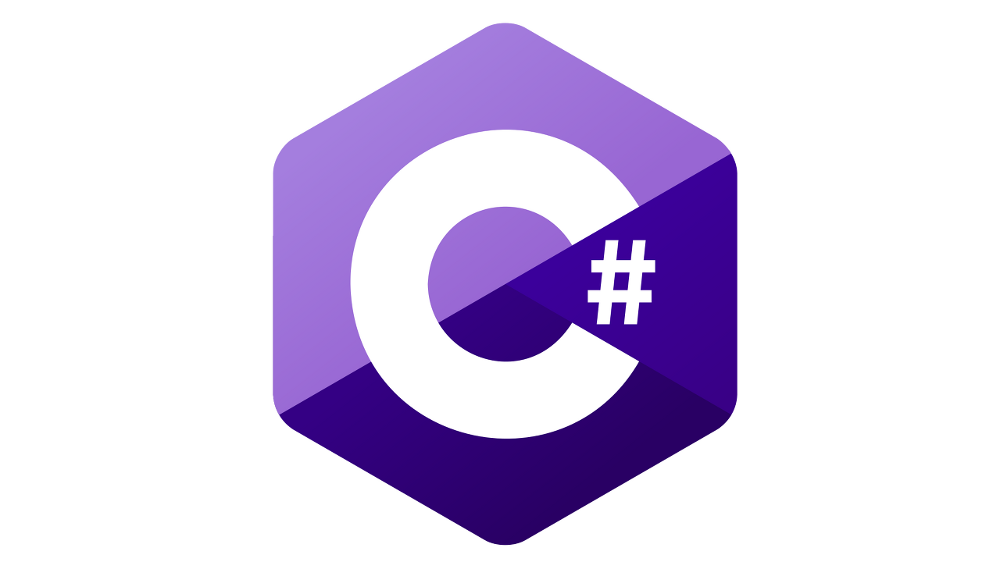

경기게임마이스터고  <br>
학생을 위한 <br>
C# 프로그래밍 입문
=================

---

# 목차

<details>
<summary><a href="#개요"> 1장. 개요 </a></summary>
<br>

- [(C#) 프로그래밍을 익혀야 하는 이유](#프로그래밍을-익혀야-하는-이유)
- [어떻게 공부하면 좋겠습니까?](#어떻게-공부하면-좋겠습니까)
- [객체지향 프로그래밍(OOP)을 왜 늦게 다루는가?](#객체지향-프로그래밍을-왜-늦게-다루는가)

</details>


<details>
<summary><a href="#기초-문법"> 2장. 기초 문법 </a></summary>
<br>

- [주석](#주석)
- [리터럴 값](#리터럴-값)
- [타입](#타입)
- [변수와 상수](#변수와-상수)

</details>

<details>
<summary><a href="#응용-문법"> 3장. 응용 문법 </a></summary>
<br>

- [응용 문법 - 1](#응용-문법---1)
- [응용 문법 - 2](#응용-문법---2)

</details>

<details>
<summary><a href="#객체지향-프로그래밍"> 4장. 객체지향 프로그래밍(OOP) </a></summary>
<br>

- [객체지향 프로그래밍 - 1](#객체지향-프로그래밍---1)
- [객체지향 프로그래밍 - 2](#객체지향-프로그래밍---2)

</details>

<details>
<summary><a href="#응용-라이브러리"> 5장. 응용 라이브러리 </a></summary>
<br>

- [응용 라이브러리 - 1](#응용-라이브러리---1)
- [응용 라이브러리 - 2](#응용-라이브러리---2)

</details>


---

# 개요
> 본 항목에서는 책에 대한 설명과 독자를 위한 정보를 제공합니다.

C#을 공부하려하는 경기게임마이스터고 학생들을 위한 교재이며, C# 프로젝트를 원활히 진행할 수 있도록 합니다.

Visual Studio Community 혹은 컴파일러를 사용 가능하다는 전제 하에 진행합니다.

위의 방법이 불가능 하다면 아래의 온라인 컴파일러 사이트를 이용하시길 바랍니다.

<details>
<summary><i><strong>온라인 컴파일러</strong></i></summary>
<br>

- [Programiz(Light, Dark)](https://www.programiz.com/csharp-programming/online-compiler/)
- [Rextester(Light, Dark)](https://rextester.com/)
- [Dotnetfiddle(Light)](https://dotnetfiddle.net/)
- [OnlineGdb(Light, Dark)](https://www.onlinegdb.com/online_csharp_compiler)

</details>

+ # 프로그래밍을 익혀야 하는 이유
> 프로그래밍을 왜 해야하는가?

경기게임마이스터고는 게임개발자를 양성하는 마이스터고이며, 여러분은 개발자를 목표로 공부합니다.

아트나 기획을 한다 하여도 기초 문법에 해당하는 코드는 작성할 수 있어야 합니다.

+ # 어떻게 공부하면 좋겠습니까
> 어떻게 공부하면 좋은가?

 &nbsp;  &nbsp;  

장마다 난이도를 나누어 두었습니다. 자신에 맞는 공부를 하고 싶다면 아래의 방식을 추천합니다.

프로그래밍 언어를 처음 접하는 분이라면 일단, 을 보는 것을 추천합니다.

프로그래밍 언어를 어느정도 공부하여 기초 문법을 쉽게 이해할 수 있다면 을 가볍게 둘러보시고 을 읽은 뒤, 을 보시면 됩니다.

마지막으로 C#을 경험한 적이 있으며 되새기는 것이 목적이라면 처음부터 하나씩 짚어보며 완독 해 보시길 바랍니다.

+ # 객체지향 프로그래밍을 왜 늦게 다루는가
> 객체지향 프로그래밍(OOP)은 왜 4장에서 다루는가?

객체간의 관계로 구조를 이루어 내는 객체지향 프로그래밍은 2, 3장에서 다루는 기본적인 문법을 익혀 선형적인 코딩을 충분히 익힌 후, 이해하며 천천히 도전해도 좋습니다.

+ # 컴파일링 테스트
> Hello World!를 출력합시다.

코드가 원활히 컴파일링 되는지 확인을 합시다.

아래의 코드를 복사하여 실행시켰을 때, 콘솔 출력으로 'Hello World!' 가 출력된다면 성공입니다.

```cs
using System;

class HelloWorld
{
    public static void Main(string[] args)
    {
        Console.Write("Hello World!");
    }
}
```

테스트에 성공했다면 다음 장으로 넘어갑시다.

---

# 기초 문법
> 프로그램을 구성하는 기초 문법에 대해 다룹니다.

+ # 주석
> 프로그램 속 메모장. 주석 처리

코드 내에서 주석을 작성하는 방법을 설명하겠습니다.

코드는 앞서 1장에서 사용한 'Hello World! 출력 코드' 를 예로서 사용합니다.

```cs
using System; // System 네임스페이스 참조

class HelloWorld
{
    public static void Main(string[] args)
    {
        Console.Write("Hello World!"); // Hello World! 출력
    }
}

/*
    실행 결과 : Hello World!
*/
```

위 코드에서 확인할 수 있듯이 '//' 는 한 줄 주석입니다. '//' 이후, 한 줄 동안은 문장이 주석 처리됩니다.

'/\* ~ \*/' 은 '/\*' 과 '\*/' 사이를 모두 주석 처리합니다.

이러한 주석은 협업을 할 때, 다른 이용자에게 코드에 대한 설명을 하기 위해 사용되거나 혹은 메모를 위해 사용될 수 있습니다.

+ # 리터럴 값
> 코딩에 사용하게 될 데이터

리터럴 값(Literal Value)은 여러분의 컴퓨터에 미리 정의되어 있는 데이터 입니다.

앞으로 이 리터럴 값을 이용하여 프로그램을 구성할 것입니다.

정수형 리터럴(integer), 실수형 리터럴(floating point), 부울형 리터럴(boolean), 문자형 리터럴(character), 문자열 리터럴(string) 로 나뉘며 이에 해당하는 데이터는 타입에 대한 설명에서 다룹니다.

+ # 타입
> 컴퓨터가 데이터를 나누는 기준

타입은 컴퓨터에 저장되는 데이터의 기준입니다.

정수형
- byte (-128 ~ 127)
- short ()
- int ()
- long ()

실수형
- float
- double
- decimal

부울형
- bool

문자형
- char

문자열
- string

+ # 변수와 상수
> 데이터의 저장, 사용

변수란 데이터를 저장하는 공간을 의미합니다.

변수에는 데이터를 담고 꺼내어 사용할 수 있습니다.

(자료형) 변수명; 형식으로 작성되며, 자료형은 선언 이후 변경할 수 없습니다.

```cs
int number; // 정수형 number 라는 이름의 변수를 선언.
```

이는 정수형(int) 으로 number 라는 이름의 변수를 사용하겠다고 선언한 것입니다.

```cs
number = 10; // 정수형 number 변수에 (정수형 리터럴 값) 10을 저장.
int num = 'a'; // 정수형 num 변수에 (문자형 리터럴 값) a를 저장. (자료형이 다른 값을 저장하려 하여 오류가 발생합니다.)
int copy = number; // 정수형 copy 변수에 정수형 number 변수를 저장. (copy 에 10이 저장됩니다.)
```

정수형 number 변수에 정수형 리터럴 값인 10을 저장한 것입니다.

만약, num 처럼 자료형에 다른 값을 저장하려 할 경우 문제가 발생하게 되니, 변수에는 선언한 자료형에 맞는 값만을 저장할 수 있습니다.

변수에 변수값을 저장하는 것도 가능합니다.

<br>

상수는 저장하는 값이 변하지 않는 변수를 의미합니다.

const (자료형) 변수명 = (값); 형식으로 작성되며, 선언과 동시에 리터럴 값을 저장해야 합니다.

상수는 최초 저장 이후 값을 저장할 수 없게 되며, 값을 꺼내는 것만 가능합니다.

```cs
const float pi = 3.14f; // 실수형 pi 상수에 (실수형 리터럴 값) 3.14를 저장.
```

실수형 pi 상수에 실수형 리터럴 값인 3.14를 저장한 것입니다.

```cs
const float pi1 = pi; // 실수형 pi1 상수에 pi 상수 저장을 시도. (상수에는 리터럴 값만 저장되기 때문에 오류가 발생합니다.)
pi = 3.1415f; // pi 상수에 저장을 시도. (상수는 값을 변경할 수 없어 오류가 발생합니다.)
```

변수를 저장하려 하거나 상수에 저장을 하려 할 경우, 오류가 발생합니다.

<br>

변수와 상수가 제대로 동작하는지 직접 출력하여 확인합시다.

```cs

using System; // System 네임스페이스 참조

class Variable
{
    public static void Main(string[] args)
    {
        const bool boolean = true; // 상수 boolean 선언 및 true 저장.
        int number = 10; // 변수 number 선언 및 10 저장.

        Console.WriteLine(boolean); // boolean에 저장된 true 출력.
        Console.WriteLine(number); // number에 저장된 10 출력.

        number = 20; // number에 20 저장.

        Console.WriteLine(number); // number에 저장된 20 출력.

        int copy = number; // 변수 copy 선언 및 number(20) 저장.

        Console.WriteLine(copy); // copy에 저장된 20 출력.
    }
}

/*
    실행 결과 : True
    10
    20
    20
*/

```


+ # 연산자
> 코딩의 기초. 연산

연산이란 특정한 값을 다른 값으로 변환하는 일을 말합니다.

이러한 연산을 연산자가 담당합니다.

이 챕터에서는 연산자의 종류를 열거하며, 이후에 직접 사용하며 익히도록 할 것입니다.

## 연산자의 분류
+ ### 피연산자의 수
  - 단항 연산자
  - 이항 연산자
  - 삼항 연산자


연산자는 크게 '피연산자의 수'와 '기능'으로 분류할 수 있습니다만, '기능'으로 분류하는 것엔 여러 기준이 존재하여 어느 것이 옳다 할 수 없기 때문에 이를 제외하였습니다.

위의 연산자의 분류. 단항 연산자, 이항 연산자, 삼항 연산자. <br>
이들은 피연산자의 수 즉, 항의 수에 따라 나뉜 것입니다. <br>
항의 수가 한 개인 연산자를 단(單)항 연산자,
두 개인 것을 이항 연산자, 세 개인 것을 삼항 연산자라 이릅니다.

## 연산자의 우선순위

연산자의 우선순위란 연산자의 연산이 진행되는 순서를 말합니다. 상황에 맞게 의도에 맞는 연산을 하기 위해선 우선순위를 숙지하는 것이 필요합니다.

[ (3 + 5) * 2 = 16 ] &nbsp;
 [ 3 + (5 * 2) = 13 ] <br>
덧셈 우선연산&nbsp;&nbsp;&nbsp;&nbsp;&nbsp;&nbsp;&nbsp;&nbsp;
곱셈 우선연산

위의 것은 수식입니다만, 연산이라는 것은 변치 않아 예로서 사용할 것입니다. 이처럼 연산을 연속적으로 할 경우, 연산순서에 따라 연산결과는 크게 달라지므로 올바른 결과로 유도하기 위해 연산자의 우선순위를 고려할 필요가 있습니다.

## 연산자의 결합방향

연산자의 결합방향은 우선순위가 동일한 연산자 간의 연산 방향을 나타냅니다. 이런 모습은 수학에서도 찾을 수 있으므로 예를 들어 설명하겠습니다.

결합방향의 종류에는 좌에서 우(  ) 와 우에서 좌 (  ) 가 있습니다.

[ 4 * 5 / 2 ] &nbsp;&nbsp;&nbsp;&nbsp; 
[ f( g( x ) ) ] <br>
&nbsp;&nbsp;&nbsp;&nbsp;&nbsp;

&nbsp;&nbsp;&nbsp;&nbsp;&nbsp;&nbsp;&nbsp;
&nbsp;&nbsp;&nbsp;&nbsp;&nbsp;&nbsp;&nbsp;


 의 예는 초등생 이상의 수학을 알고 있다면 연산 순서를 이해할 것입니다. * 와 / 는 이항 연산자이며 우선순위가 동일하고 결합방향이  입니다.

 의 예는 함수의 성질을 알고 있다면 이해할 것입니다. 먼저 g( x ) 의 연산이 이루어지고 그 결과값이 f() 의 입력값으로서 연산되는 순서로, f() 와 g() 는 단항 연산자이며 우선순위가 동일하고 결합방향이  입니다.

## 연산자의 종류

|우선순위|연산자|설명|분류|결합방향|
|-|-|-|-|-|
|1|[]|인덱서|이항연산자||
||()|함수 호출|기타||
||.|요소 선택|기타||
||++|후위 증가|단항연산자||
||--|후위 감소|단항연산자||
|2|!|논리 부정 연산자|단항연산자||
||~|NOT 연산자|단항연산자||
||+|양의 부호|단항연산자||
||-|음의 부호|단항연산자||
||sizeof|메모리 크기|기타||
||new|메모리 할당|기타||
||()|캐스트 연산자|기타||
||++|전위 증가|단항연산자||
||--|전위 감소|단항연산자||
|3|*|곱셈 연산자|이항연산자||
||/|나눗셈 연산자|이항연산자||
||%|나머지 연산자|이항연산자||
|4|+|덧셈 연산자|이항연산자||
||-|뺄셈 연산자|이항연산자||
|5|<<|좌측 시프트 연산자|이항연산자||
||>>|우측 시프트 연산자|이항연산자||
|6|>|관계 연산자(좌측이 큼)|이항연산자||
||>=|관계 연산자(좌측이 크거나 같음)|이항연산자||
||<|관계 연산자(좌측이 작음)|이항연산자||
||<=|관계 연산자(좌측이 작거나 같음)|이항연산자||
|7|==|관계 연산자(같음)|이항연산자||
||!=|관계 연산자(다름)|이항연산자||
|8|&|AND 연산자|이항연산자||
|9|^|XOR 연산자|이항연산자||
|10|\||OR 연산자|이항연산자||
|11|&&|논리 곱 연산자|이항연산자||
|12|\|\||논리 합 연산자|이항연산자||
|13|?:|삼항 조건 연산자|삼항연산자||
|14|=|대입 연산자|이항연산자||
||+=|(A = A + B)|이항연산자||
||-=|(A = A - B)|이항연산자||
||*=|(A = A * B)|이항연산자||
||/=|(A = A / B)|이항연산자||
||%=|(A = A % B)|이항연산자||
||<<=|(A = A << B)|이항연산자||
||>>=|(A = A >> B)|이항연산자||
||&=|(A = A & B)|이항연산자||
||^=|(A = A ^ B)|이항연산자||
||\|=|(A = A \| B)|이항연산자||
|15|throw|예외 연산자|기타||
|16|,|쉼표 연산자|기타||

## new 연산자

new 연산자는 데이터를 저장하기 위한 공간을 할당하는 연산자 입니다.

```cs

using System; // System 네임스페이스 참조

class NewOperator
{
    public static void Main(string[] args)
    {
        int a = 1; // a에 1을 저장.
        Console.Write(a); // a에 저장된 값을 출력.
    }
}

/*
    실행 결과 : 1
*/

```

사실 위의 코드는 간략화되어 있습니다.

저장 공간을 할당하는 구문을 생략한 것입니다.

```cs

using System; // System 네임스페이스 참조

class NewOperator
{
    public static void Main(string[] args)
    {
        int a = new int(); // a에 int 자료형에 알맞은 공간을 할당.
        a = 1; // a에 1을 저장.
        Console.Write(a); // a에 저장된 값을 출력.
    }
}

/*
    실행 결과 : 1
*/

```

생략하지 않을 경우, 이처럼 나타낼 수 있습니다.

+ # 배열
> 변수의 집합

배열이란 다수의 변수를 접근하기 쉽도록 집합시킨 것입니다.

[]은 배열을 나타내는 연산자임과 동시에 인덱서 연산자입니다.

(자료형)[] (ex : int[], string[], ...) 의 모습으로 하나의 배열 자료형이 됩니다. 이러한 배열 자료형은 일반적인 자료형과 달리 배열의 형태를 띄게 됩니다.

배열의 공간을 할당하는데는 일반자료형과는 조금 다른 형식을 사용합니다.

```cs

using System; // System 네임스페이스 참조

class ArrayAllocate
{
    public static void Main(string[] args)
    {
        int[] array = new int[2]; // 2크기의 int 배열의 공간을 할당.
    }
}

/*
    실행 결과 :
*/

```

배열은 new 연산자를 사용하여 [] 안에 배열의 크기를 넣어 크기만큼의 공간을 할당합니다.

이렇게 만들어 낸 배열의 저장 공간에 접근하기 위해선 각각의 공간의 위치를 나타내는 수(index)를 이용해야합니다.

(변수명)[(index)] 의 형식으로 접근할 수 있으며, index는 0에서 시작하여 (배열의 크기 - 1) 까지의 범위로 나타냅니다.


<br>


```cs

using System; // System 네임스페이스 참조

class ArrayIndex
{
    public static void Main(string[] args)
    {
        int[] array = new int[2]; // 2크기의 int 배열의 공간을 할당.
        array[0] = 4; // array의 첫 번째 공간에 4 저장.
        array[1] = 2; // array의 두 번째 공간에 2 저장.

        Console.WriteLine(array[0]); // array의 첫 번째 공간에 저장된 4를 출력
        Console.WriteLine(array[1]); // array의 두 번째 공간에 저장된 2를 출력
    }
}

/*
    실행 결과 : 4
    2
*/

```

index를 이용하여 array의 요소에 접근하여 배열을 사용하는 방법을 알아보았습니다.

+ # 함수
> 

---

# 응용 문법
> 응용 문법 설명

+ # 응용 문법 - 1
> 응용 문법 1 부제

+ # 응용 문법 - 2
> 응용 문법 2 부제

---

# 객체지향 프로그래밍
> 객체지향 프로그래밍(OOP) 설명

+ # 객체지향 프로그래밍 - 1
> 객체지향 프로그래밍 1 부제

+ # 객체지향 프로그래밍 - 2
> 객체지향 프로그래밍 2 부제

---

# 응용 라이브러리
> 응용 라이브러리 설명

+ # 응용 라이브러리 - 1
> 응용 라이브러리 1 부제

+ # 응용 라이브러리 - 2
> 응용 라이브러리 2 부제

---
